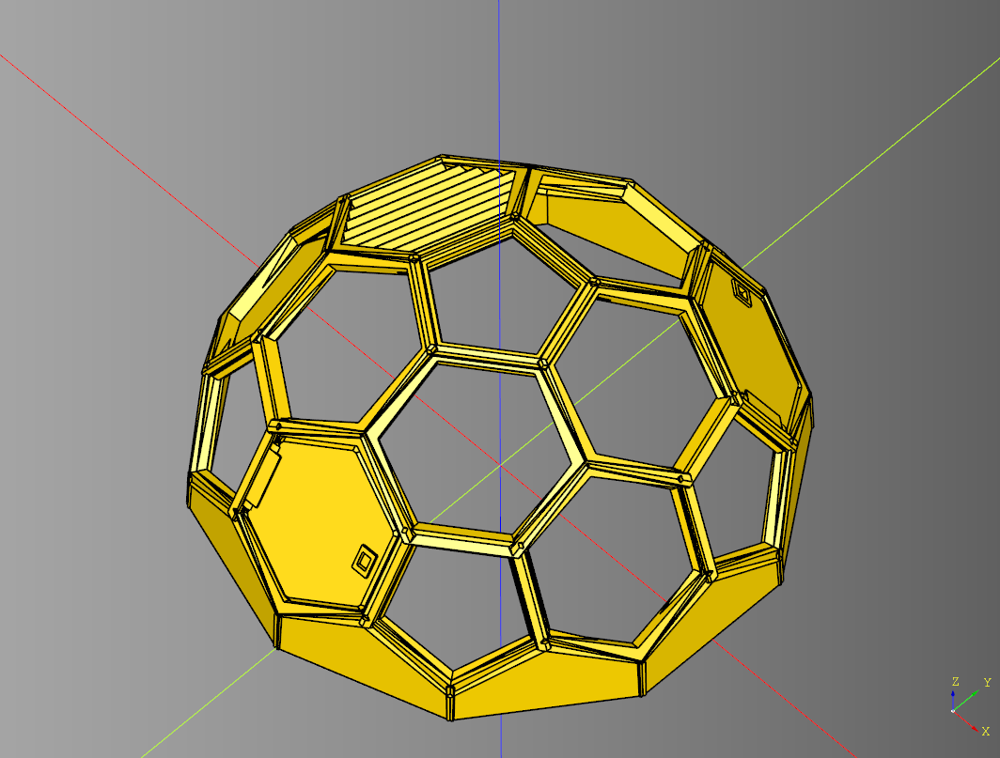

# cqdome
python Library for making dome terrain.

<br /><br />

### Example Usage

``` python
```

## Dependencies
* [CadQuery 2.1](https://github.com/CadQuery/cadquery)
* [cqterrain](https://github.com/medicationforall/cqterrain)


### Installation
To install cqdome directly from GitHub, run the following `pip` command:

	pip install git+https://github.com/medicationforall/cqdome

**OR**

### Local Installation
From the cloned cqdome directory run.

	pip install ./
