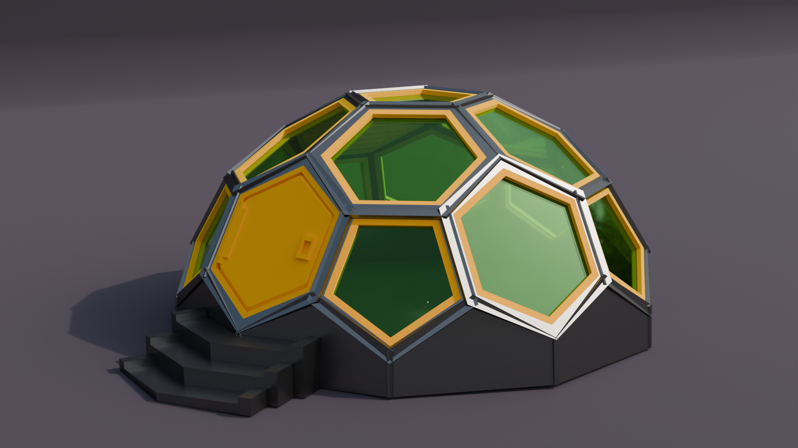

# cqdome
Python Library for making a truncated icosahedron dome terrain written in [cadquery](https://cadquery.readthedocs.io/en/latest/intro.html). <br />The dome consists of an open frame and parts that can be attached.

[](./example/dome.py)<br /><br />

### Example Usage

``` python
import cadquery as cq
from cqdome import Dome, greeble

#init greebles
vent_bp = greeble.VentHexagon()
door_bp = greeble.DoorHexagon()
door_bp.hinge_x_translate = -4.5

window_pen_bp = greeble.WindowFrame()
window_pen_bp.type="pentagon"
window_pen_bp.margin=.1
window_pen_bp.render_pane = False

window_hex_bp = greeble.WindowFrame()
window_hex_bp.type="hexagon"
window_hex_bp.render_pane = False

# make dome
bp = Dome()

#center
bp.greebles_bp.append(window_pen_bp)

#ring 1
bp.greebles_bp.append(vent_bp)
bp.greebles_bp.append(window_hex_bp)
bp.greebles_bp.append(window_hex_bp)
bp.greebles_bp.append(window_hex_bp)
bp.greebles_bp.append(window_hex_bp)

#ring2
bp.greebles_bp.append(window_pen_bp)
bp.greebles_bp.append(window_hex_bp)
bp.greebles_bp.append(window_pen_bp)
bp.greebles_bp.append(window_hex_bp)
bp.greebles_bp.append(window_pen_bp)
bp.greebles_bp.append(door_bp)
bp.greebles_bp.append(window_pen_bp)
bp.greebles_bp.append(window_hex_bp)
bp.greebles_bp.append(window_pen_bp)
bp.greebles_bp.append(door_bp)

bp.render_greebles = True
bp.make()
dome = bp.build()

show_object(dome)
```

[example](./example/dome.py)

## Documentation
* [Dome](./documentation/dome.md)

## Dependencies
* [CadQuery 2.1](https://github.com/CadQuery/cadquery)
* [cqterrain](https://github.com/medicationforall/cqterrain)

## Projects
* [Dome Terrain](https://miniforall.com/dometerrain)

[](https://miniforall.com/dometerrain)


### Installation
To install cqdome directly from GitHub, run the following `pip` command:

	pip install git+https://github.com/medicationforall/cqdome

**OR**

### Local Installation
From the cloned cqdome directory run.

	pip install ./

---

## Running Example Scripts
[example_runner.py](example_runner.py) runs all examples.

``` bash
C:\Users\<user>\home\3d\cqdome>python example_runner.py
```

**OR**

### Running individual examples
* From the root of the project run one of the example scripts:
  
``` bash
C:\Users\<user>\home\3d\cqdome>python ./example/dome.py
```
